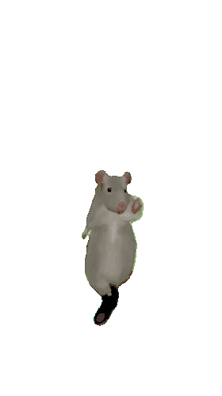

# Following J124 Tutorial

This is a sample markdown file. This description will show on the front page of my repository.

## _This is a subtitle at level two_

(in *italics*...)

## Indentation

I'm going to indent something:

> Does this work?

What is monospace? 
<samp>What is monospace?</samp>

## Rat dancing

Here's a gif of a rat dancing: 

